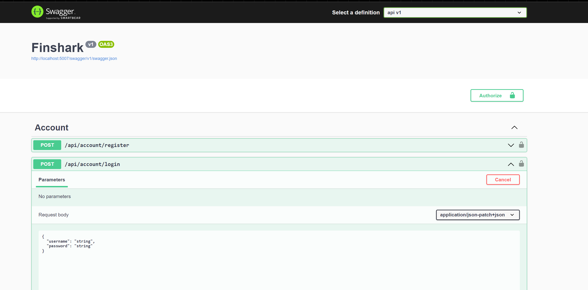
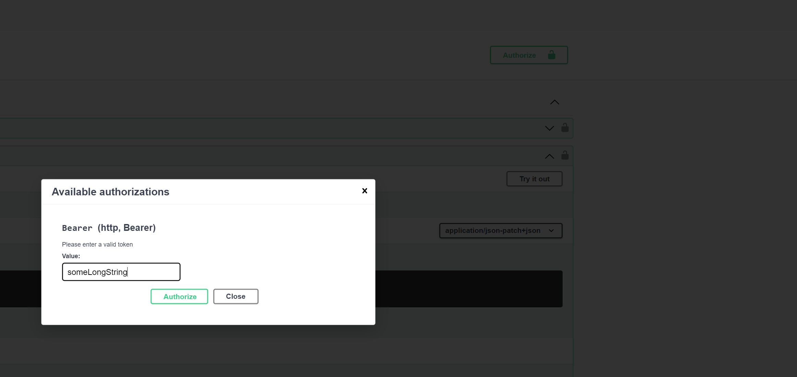
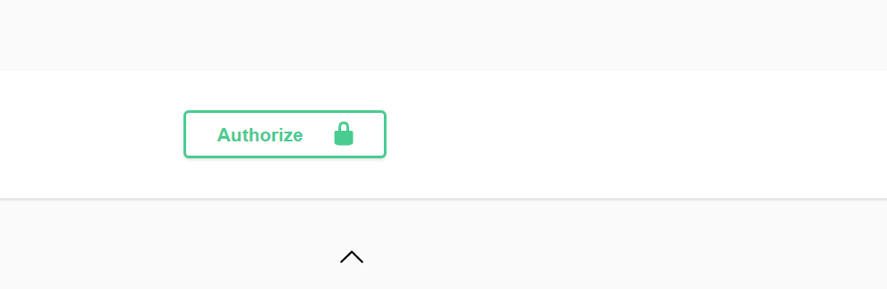
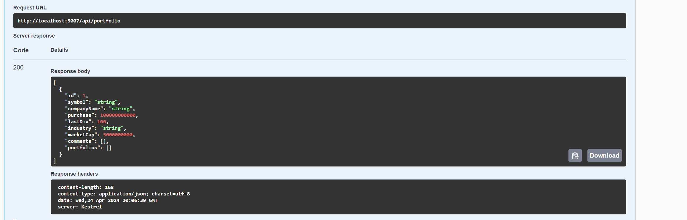

# Intro

Finshark is an API for delivering stock data. This is based on a project from [Teddy Smith](https://www.youtube.com/playlist?list=PL82C6-O4XrHfrGOCPmKmwTO7M0avXyQKc).

## Environment Setup

You will need:

1. Download SQL Server. Download from [Microsoft](https://www.microsoft.com/en-us/sql-server/sql-server-downloads). It's recommended to download the Express version
2. Edit `appsettings.sample.json` and rename it to `appsettings.sample.json` when you're ready for production use 

## Development commands

`dotnet run watch` will run your project in a hot reload environment

## Quickstart

Once the server is up and running, run `dotnet watch run` which will open Swagger (an api doc generation tool). You can then use the `api/account/login` endpoint to login or use `api/account/register` to register and retrieve a token. The response once you login or register will look like the following:



```json
{
  "userName": "user",
  "email": "user@example.com",
  "token": "someLongString"
}
```

Once you receive a token, click the authorize button in the top corner and use this to authenticate and paste your token



Now the Authorize button will show a locked symbol indicating that Swagger is now holding a token and will send that as an HTTP header with every request. In this way, you can use authorized routes like the portfolio routes.



